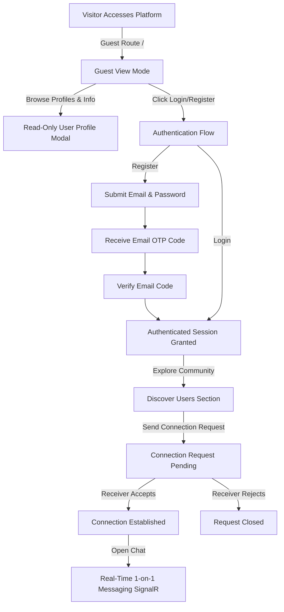

# 🌐 AtConnect - Real-Time Privacy-First Messaging Platform

> *"A real-time messaging platform that enables users to connect using email instead of phone numbers. Users establish communication through mutual connection requests before accessing private one-to-one chats, ensuring privacy and controlled interactions."*

---

## 📌 Overview

**AtConnect** is a modern, privacy-focused web application built to eliminate the need for sharing personal phone numbers to communicate. By leveraging **email-based identification**, AtConnect ensures user privacy while facilitating controlled, meaningful interactions. 

Before engaging in private 1-on-1 chats, users must send and accept **mutual connection requests**. The platform also features a dedicated **Guest View Mode**, allowing unauthenticated visitors to discover the community and browse profiles in read-only mode prior to signing up.

---

## ✨ Key Features

- 📧 **Email-Based Connections**: Connect with friends and professionals using unique email addresses, keeping personal phone numbers private.
- 🔐 **Mutual Connection Requests**: Privacy-first interaction control—chatting is unlocked only after a recipient accepts a connection request.
- 👁️ **Guest View-Only Mode**: Allows unauthenticated visitors to explore community members, search users, and view public profile details in read-only mode before signing up.
- ⚡ **Real-Time 1-on-1 Messaging**: Instant message delivery, dynamic active chat updates, and unread notification indicators powered by WebSockets via SignalR.
- 🔑 **Secure Authentication & OTP Verification**: Account registration backed by email verification OTP codes, dual JWT tokens (AccessToken + RefreshToken), and background silent token refresh.
- 🚀 **Infinite Scrolling & Smart Caching**: Seamless user browsing and message history loading powered by TanStack React Query v5 infinite queries.
- 📱 **Responsive & Modern UI/UX**: Crafted with TailwindCSS v3 featuring sleek dark aesthetics, smooth micro-animations, glassmorphism UI elements, and mobile drawer navigation.

---

## 🏗️ Architecture

The project follows a **Feature-Sliced Modular Architecture** on the frontend, combined with a **RESTful & WebSocket-driven backend API** (ASP.NET Core Web API + SignalR Hubs).

```
+-----------------------------------------------------------------------+
|                             AtConnect Client                          |
|  (React 19 + Vite + TailwindCSS + React Router v7 + Zustand + Query)  |
+-----------------------------------+-----------------------------------+
                                    |
            +-----------------------+-----------------------+
            | HTTP / REST (Axios)                           | WebSockets (SignalR)
            v                                               v
+-----------------------------------+   +-------------------------------+
|         ASP.NET Core API          |   |      SignalR Chat Hub         |
|  - JWT Authentication             |   |  - Real-time Messaging        |
|  - Connection Requests Logic      |   |  - Live Online/Offline Status |
|  - User Profiles & Management     |   |  - Instant Notifications      |
+-----------------------------------+   +-------------------------------+
                                    |
                                    v
                        +-----------------------+
                        |   Entity Framework    |
                        |   Core / SQL Database |
                        +-----------------------+
```

### Key Architectural Highlights:
- **Feature-Based Modular Structure**: Code is partitioned into self-contained feature folders (`auth`, `guest`, `home`, `messages`), isolating API requests, state stores, custom hooks, and UI components.
- **Resilient JWT Authentication & Silent Refresh**: An Axios request/response interceptor automatically injects `Bearer` tokens and transparently refreshes expired Access Tokens using a concurrency-safe queue without interrupting the user.
- **Hybrid Data Fetching & Caching**: Powered by **TanStack React Query v5** for server-state management, pagination, and infinite loading, alongside **Zustand** with `localStorage` persistence for client session state.
- **Real-Time Event-Driven Messaging**: Integrated with `@microsoft/signalr` for instant payload delivery and live unread badge updates.

---

## 🔄 Main Workflows



### 1. 🔐 Authentication & Email Verification
1. User signs up with email, password, and profile details.
2. An **OTP Verification Code** is dispatched to the user's email.
3. Upon code verification, the server issues a JWT **AccessToken** and **RefreshToken**.
4. Credentials are securely managed via Zustand and persisted to `localStorage`.

### 2. 👁️ Guest View-Only Mode
1. Unauthenticated visitors land on `/` (`GuestPage`).
2. Visitors can search and explore community profiles in read-only mode (`GuestUsersSection`).
3. Clicking a user opens a **Guest Profile Modal** displaying public bio and skills, with interactive messaging disabled until registration.

### 3. 🤝 Discovery & Mutual Connection Requests
1. Logged-in users explore available profiles on `/home`.
2. Sending a connection request triggers a request item in the target user's **Chat Requests** banner.
3. Once accepted, both users become connected, unlocking private messaging.

### 4. 💬 Real-Time 1-on-1 Messaging
1. Connecting to the **SignalR Hub** establishes a live WebSocket connection.
2. Connected users can send text messages with instant delivery, automatic scroll anchoring, and unread counters.

---

## 🛠️ Tech Stack

### Frontend
- **Framework & Build Tool:** [React 19](https://react.dev/), [Vite 8](https://vitejs.dev/)
- **Routing:** [React Router v7](https://reactrouter.com/)
- **State Management:** [Zustand v5](https://zustand-demo.pmnd.rs/) (with `persist` middleware)
- **Server State & Caching:** [TanStack React Query v5](https://tanstack.com/query/latest)
- **Real-Time Communication:** [@microsoft/signalr v10](https://learn.microsoft.com/en-us/aspnet/core/signalr/javascript-client)
- **HTTP Client:** [Axios](https://axios-http.com/)
- **Form Validation:** [React Hook Form](https://react-hook-form.com/), [Yup](https://github.com/jquense/yup)
- **Styling:** [TailwindCSS v3](https://tailwindcss.com/), [Lucide React Icons](https://lucide.dev/)

---

## 📁 Project Structure

```
AtConnect-Web/
├── public/                     # Static assets and public files
├── src/
│   ├── api/                    # Core API instances & SignalR connection manager
│   │   ├── axios.js            # Axios client with JWT interceptor & refresh token queue
│   │   └── signalR.js          # SignalR websocket connection handler
│   ├── assets/                 # SVGs, images, and global media assets
│   ├── components/             # Shared UI components (DatePicker, Modals, etc.)
│   ├── features/               # Feature-Sliced Domain Modules
│   │   ├── auth/               # Login, Register, Email Verification & Auth Store
│   │   ├── guest/              # Guest Mode layout, header, cards & profile modal
│   │   ├── home/               # Discover section, user cards & connection requests
│   │   └── messages/           # Chat list, conversation area, message bubbles & stores
│   ├── pages/                  # Top-level page views
│   │   ├── GuestPage.jsx       # Public guest landing page
│   │   ├── HomePage.jsx        # Authenticated home feed & discovery
│   │   ├── LoginPage.jsx       # User login screen
│   │   ├── MessagesPage.jsx    # Real-time messaging dashboard
│   │   ├── RegisterPage.jsx    # User registration screen
│   │   └── VerifyEmailPage.jsx # Email verification code screen
│   ├── utils/                  # Utility helpers (image validation, formatters)
│   ├── App.jsx                 # Application routes & ProtectedRoute wrappers
│   ├── index.css               # Global TailwindCSS styles & design tokens
│   └── main.jsx                # React app entry point with QueryClientProvider
├── index.html
├── package.json
├── tailwind.config.js
└── vite.config.js
```

---

## 🚀 Getting Started

### Prerequisites
Make sure you have the following installed on your system:
- **Node.js**: `v18.x` or higher
- **npm**: `v9.x` or higher

### Installation

1. **Clone the repository:**
   ```bash
   git clone https://github.com/Mohamed-ALQarram/AtConnect-Web.git
   cd AtConnect-Web
   ```

2. **Install dependencies:**
   ```bash
   npm install
   ```

3. **Start the development server:**
   ```bash
   npm run dev
   ```

4. **Access the application:**
   Open your browser and navigate to `http://localhost:5173`.

### Available Scripts

- `npm run dev` - Launches Vite development server with HMR.
- `npm run build` - Compiles production-ready bundle.
- `npm run preview` - Locally previews the production build.
- `npm run lint` - Runs ESLint code quality checks.

---

## 📄 License

Distributed under the MIT License. See `LICENSE` for more information.
